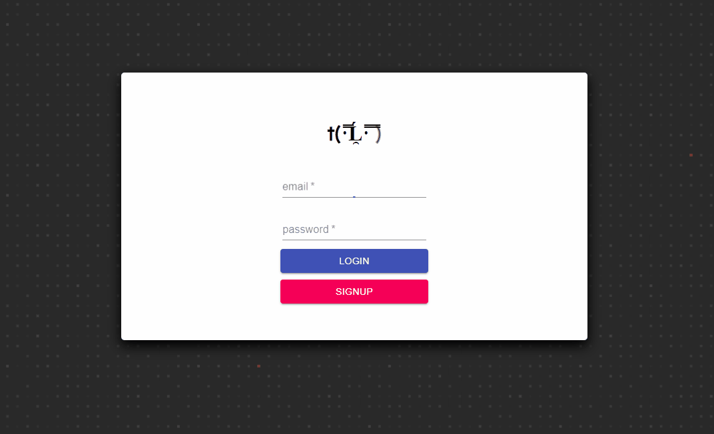

# Note10Net (Note Over Internet)

this is a fun project made just to apply all the knowledge been learned after finish taking React course on freecodecamp.

## Display

### The app is deployed on heroku: [sexgod.herokuapp.com](https://sexgod.herokuapp.com)  

## Dependencies

1. React(js)
2. MaterialUI - all ui been made using some pure css and most MaterialUI
3. Firebase(firestore & firebase auth) - for db and authentication
4. marked - markdown support
5. github-markdown-css - styling the markdown
6. react-highlight - code styling for markdown
7. Google Font - of course for font, what else you hope

## Features

- Login and Signup
- User only be a able to see their post
- Writes formatted code in notes
- Update and Delete posts

## Issues and Improvement to be made

- for whatever kind of reason the input is pretty slow
- to make cleaner code

# NOTE!!

nobody will contribute to this but its ok but:

- since the firebase config is meant to be at the author(me)'s db so if this project is used then it will uploaded on my db.
- in other to change db is just by editing the config on `./src/firebase.js` and replace it with your own sdk
